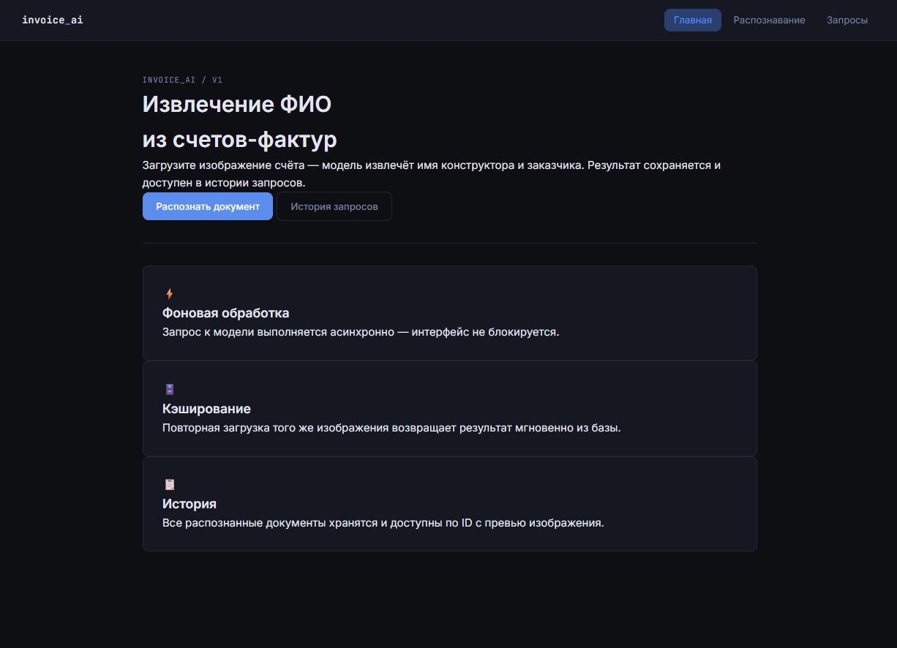
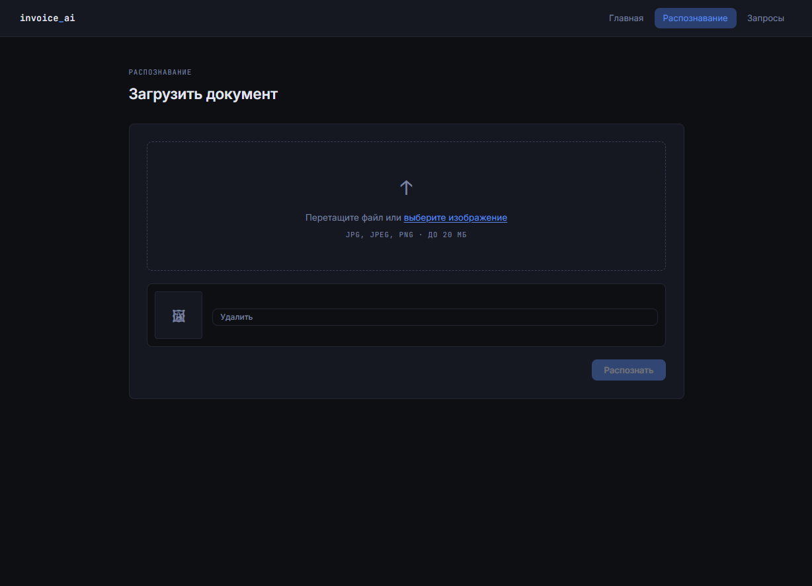
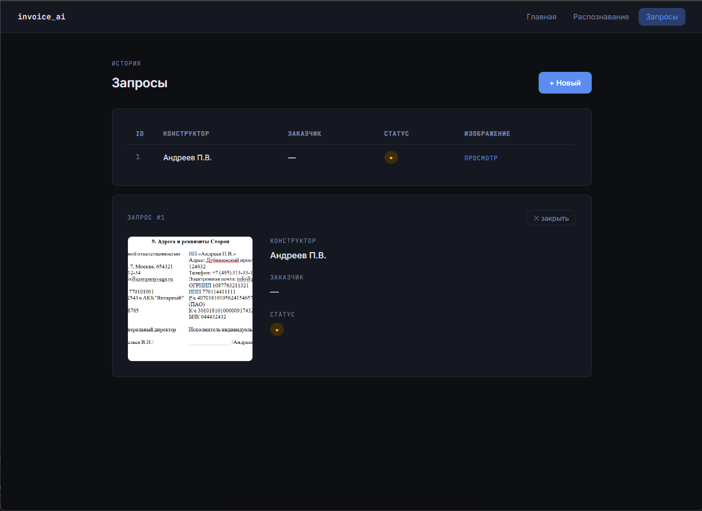
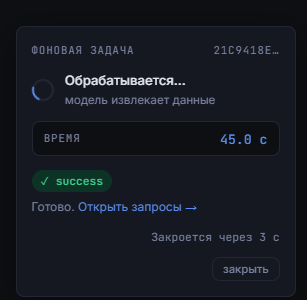

# Проект по извлечению Ф.И.О из документа в формате картинки!

## Описание проекта

Сервис предназначен для автоматического извлечения полных имен (Ф.И.О.) исполнителя (`contractor_name`) и заказчика (`customer_name`) из документов, представленных в графических форматах (PNG, JPEG).

**Ключевые особенности:**

- Поддержка загрузки изображений через `REST API `
- Распознавание текста с использованием **PaddleOCR**
- Семантический анализ и извлечение сущностей с помощью LLM (модель `openai/gpt-oss-20b:free` через OpenRouter)
- Автоматическое сохранение результатов в PostgreSQL
- Веб-интерфейс для просмотра всех обработанных документов

```
input -> fastapi -> paddleocr -> langchain -> `openai/gpt-oss-20b:free` -> DB
```

**Последовательность обработки:**

1. Пользователь загружает изображение документа
2. `FastAPI` принимает запрос и передает изображение в пайплайн
3. `PaddleOCR` выполняет оптическое распознавание символов (OCR)
4. LangChain формирует запрос к LLM через `OpenRouter`
5. Модель анализирует распознанный текст и извлекает Ф.И.О. заказчика и исполнителя
6. Результаты сохраняются в `PostgreSQL`
7. Пользователь может просмотреть все обработанные документы на отдельной странице

**Скриншоты**










---

## Стек

| Компонент                                        | Технологии            |
| --------------------------------------------------------- | ------------------------------- |
| **Язык программирования**       | Python 3.12                     |
| **Веб-фреймворк**                       | FastAPI, Uvicorn                |
| **ML/OCR**                                          | PaddleOCR, PaddlePaddle-GPU     |
| **LLM-интеграция**                        | LangChain, LangChain-OpenRouter |
| **База данных**                           | PostgreSQL, SQLAlchemy (async)  |
| **Контейнеризация**                  | Docker                          |
| **Веб-сервер**                             | Nginx                           |
| **Тестирование**                        | Pytest, Pytest-asyncio          |
| **Управление зависимостями** | UV                              |
| **Система контроля версий**    | Git                             |

## Установка

Можно запустить проект **локально** или же собрать через [docker-compose.yml](docker-compose.yml). Также нужен ключ `open-router`, создать можно [тут](https://openrouter.ai/).

### Переменные окружения

Для начала нужно настроить переменные окружения! В проекте есть **переменные окружения** для запуска докер образа и локального, называются соответственно [.env.docker.example](.env.docker.example) или [.env.local.example](.env.local.example). Прописываете данные и убираете и переименовываете `.env.docker.example` -> `.env.docker` или `.env.local.example` -> `.env`.

> ВАЖНО! Если запускаете локально, то нужно иметь установленную локально`postresql` (желательно версии 17.10). И там создать базу данных с именем `invoice_app_db`.

Пример:

```env
OPENROUTER_API_KEY=sk-as-v143215fdsaf...

# invoice_app db auth
DB_HOST=postgres
DB_PORT=5432
DB_USER=my_user
DB_PASS=1234
DB_NAME=invoice_app_db

# Postgres
POSTGRES_USER=postgres
POSTGRES_PASSWORD=1234
POSTGRES_DB=invoice_app_db

MODE=DOCKER_COMPOSE_IMAGE
```

> ВАЖНО! `DB_USER` == `POSTGRES_USER`, `DB_PASS` == `POSTGRES_PASSWORD`, `DB_NAME` == `POSTGRES_DB`

### Локально

#### 1. Для начала нужно установить `uv`. Полную информацию можно найти [тут](https://docs.astral.sh/uv/getting-started/installation/).

```bash
curl -LsSf https://astral.sh/uv/install.sh | sh
```

Если нет `curl`

```bash
wget -qO- https://astral.sh/uv/install.sh | sh
```

#### 2.. Установить зависимости через `uv`:

```bash
uv sync
```

#### 3. Установить `PaddlePaddle` отдельно (не на PyPI):

```bash
uv pip install paddlepaddle-gpu==3.3.0 -i https://www.paddlepaddle.org.cn/packages/stable/cu130/
uv pip install paddleocr==3.6.0
```

##### 3.1. Можно активировать виртуальное окружение. (этот шаг можно пропустить)

```bash
source .venv/bin/activate
```

#### 4. Запустить приложение:

```bash
uv run app/main.py
```

Чтобы остановить нужно прожать `Ctrl + c` находясь в нужном терминале!

## Docker

Для запуска образа вам нужно перейти в папку с проектом, где у вас будет настроенная переменная окружения!

```bash
cd invoice_ai/
```

Далее просто запустить приложение

```bash
docker compose up
```

Для остановки приложения

```bash
docker compose stop
```

Для остановки приложения с удалением контейнера

```bash
docker compose down
```

Для остановки приложения с удалением `volumes` добавьте `-v`

```bash
docker compose down -v
```
